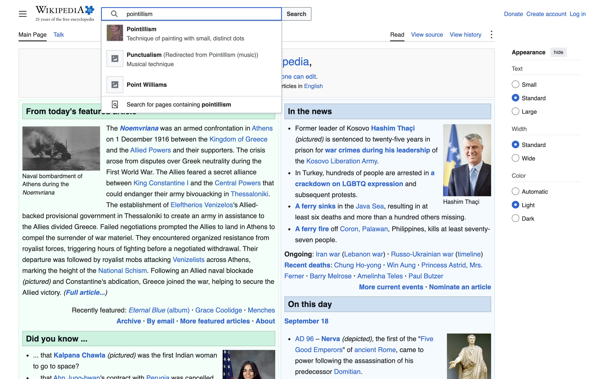
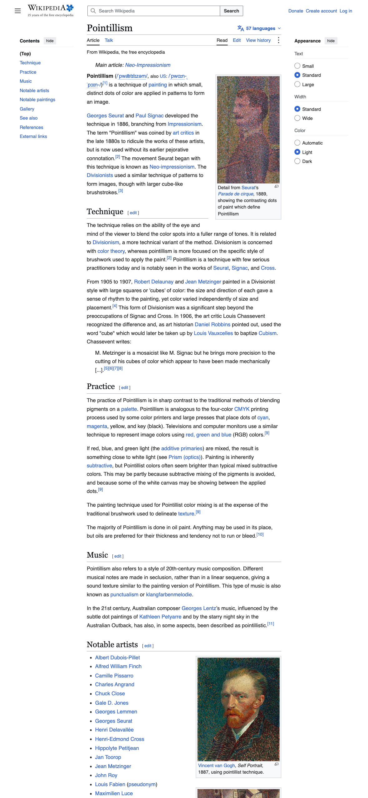

<p align="center">
  
</p>

<p align="center"><em>See how it actually works.</em></p>

---

An agent drives your app the way a person would — clicking, typing, tapping,
running commands — and writes down what it saw. Web, iOS, Android, desktop,
command line. Every capture is dated against a commit, so you always know
whether the documentation still matches the product.

Two halves that share one data contract:

```
plugins/walkthrough/   the SKILL — drives an app and writes down what it saw
apps/hub/              the HUB   — reads what the skill wrote and publishes it
```

The skill runs in **Claude Code** or **Codex**. The hub is a Next.js app that
reads plain JSON and PNGs off disk — no database, no build step for content.

See the running library at
[walkthrough.humanquest.net](https://walkthrough.humanquest.net).

## See the output

The repository includes a complete, reproducible Wikipedia walk across desktop
and mobile. These are the actual files the hub renders.

| Search on desktop | The same article on mobile |
| --- | --- |
| [](https://walkthrough.humanquest.net/wikipedia/features/search) | [](https://walkthrough.humanquest.net/wikipedia/features/article) |

[Watch the fact-checker journey](apps/hub/public/walkthroughs/wikipedia/personas/verify-a-claim-story.mp4)
or [open it in the live hub](https://walkthrough.humanquest.net/wikipedia/personas/fact-checker/journeys/verify-a-claim).

---

## Why this exists

Product documentation rots silently. A screenshot taken in March is
indistinguishable from one taken yesterday, so nobody knows which parts of the
onboarding guide are still true. The usual fix is discipline, which doesn't
scale, or automated visual regression, which tells engineers that pixels changed
without telling anyone *what the user now experiences*.

This takes a different line: **capture is cheap, so re-capture often, and make
staleness visible.** Each run records the commit it was taken against. The hub
diffs that against the app's current HEAD and says, on every page, whether what
you're reading can be trusted.

And it is built to be **self-critical**. The hub checks its own contents and
reports what it finds: captures that are byte-identical between steps (so
nothing happened between them), files referenced but missing, coverage claimed
with nothing behind it, locale slices inflating a feature count. A publishing
tool shows you what it was given; this one tells you when what it was given is
wrong.

---

## Any app, not just web apps

The original version of this was web-shaped — a project had a URL, a step had a
`route`, a capture had a `viewport` that was `desktop` or `mobile`. None of that
survives contact with an iOS app, a macOS menu-bar utility, or a CLI. So three
web-specific concepts are replaced by three general ones:

| Web-shaped | General | Why |
|---|---|---|
| `url` | **`target`** | A base URL for web; a bundle id and simulator for mobile; an executable for desktop; a binary for a CLI. |
| `route` | **`location`** | One string whose *semantics* depend on the platform — a path, a screen id, a window path, an argv. |
| `viewport` | **`surface`** | A named surface with real dimensions and a frame kind, so the hub knows whether to draw browser chrome, a phone bezel, a window title bar, or a terminal. |

| Platform | Driver | `location` looks like |
|---|---|---|
| `web` | Playwright, or headless Chrome | `/settings/billing` |
| `ios` | iOS Simulator (`simctl`) | `SettingsScreen` |
| `android` | emulator or device (`adb`) | `com.acme/.SettingsActivity` |
| `desktop` | Playwright-Electron, or the OS accessibility layer | `Preferences › Network` |
| `cli` | a pseudo-terminal | `acme deploy --dry-run` |

A product shipping both a web app and an iOS app is two registry entries, even
though they share a repo — they're reached differently, driven differently, and
captured on different surfaces.

---

## Quick start

```bash
pnpm install
pnpm dev          # → http://localhost:3000
pnpm run doctor   # local providers and target readiness
pnpm verify       # deterministic local verification, including a production build
```

Use `pnpm run doctor`, not `pnpm doctor`: `doctor` is also a pnpm built-in, so
the shorter spelling can exit successfully without running this repository's
readiness checks.

The hub ships with **one** registered app: Wikipedia — search, reading an
article, and the revision history, walked live across desktop and mobile. It's
the sample because anyone can reproduce it:

```bash
pnpm walk:sample     # re-walks it; no account, no build, no secrets
```

Article text is available under CC BY-SA 4.0. It's a sample, not an affiliation.

**To start from empty**, point the hub at your own app instead:

```bash
pnpm reset:demo      # removes the sample and blanks the registry
node scripts/new-project.mjs --slug=my-app --name="My App" --platform=web \
  --url=http://localhost:3000 --codebase=~/code/my-app
```

One thing the sample makes honest: a third-party site has no local checkout, so
the drift card reads **unknown** and says why. Drift only truly works on an app
you have the source for — that's what `codebase.local` is for, and pointing this
at your own app is where the tool starts earning its keep.

### Register your app

```bash
node scripts/new-project.mjs
```

Or add an entry to [`apps/hub/projects.json`](apps/hub/projects.json) by hand:

```jsonc
{
  "slug": "acme-web",
  "name": "Acme",
  "target": {
    "platform": "web",
    "local": "http://localhost:5173",
    "launch": { "command": "pnpm dev", "cwd": "../acme", "port": 5173 }
  },
  "codebase": { "local": "~/code/acme", "github": "acme/acme" },
  "auth": {
    "type": "email-password",
    "loginLocation": "/login",
    "roles": { "member": { "email": "member@acme.test", "password": "$ACME_MEMBER_PASSWORD" } }
  }
}
```

Secrets are `$ENV_VAR` placeholders resolved from `.env.local` at render time.
**Never put a literal password in `projects.json`** — it's committed.

### Walk it

In Claude Code or Codex, from the repo root:

```
/walkthrough --project=acme-web
```

That's a full run: discover features, walk each one on every surface, walk each
persona's journey, verify recent bug fixes, record the run. Smaller slices:

```
/walkthrough catalog                  discover features only, no captures
/walkthrough /settings/billing        one feature
/walkthrough --persona new-user       one user's journey
/walkthrough verify                   before/after proof for recent fixes
/walkthrough pr                       a PR whose body shows what changed
```

---

## The skill

Canonical location:
[`plugins/walkthrough/skills/walkthrough/SKILL.md`](plugins/walkthrough/skills/walkthrough/SKILL.md)

**Claude Code** — already wired: `.claude/skills/walkthrough` symlinks to it, so
`/walkthrough` works in this repo with no install. To use it in another repo,
add this one as a plugin marketplace (`.claude-plugin/marketplace.json`) or copy
`plugins/walkthrough/` across.

**Codex** — `/walkthrough` comes from
[`.codex/prompts/walkthrough.md`](.codex/prompts/walkthrough.md), and
[`AGENTS.md`](AGENTS.md) points at the canonical path so the skill is findable
even without slash-command support.

Both runtimes read the same [`AGENTS.md`](AGENTS.md); `CLAUDE.md` is a one-line
import of it, so the two can't drift.

### What's in it

| | |
|---|---|
| [`references/output-format.md`](plugins/walkthrough/skills/walkthrough/references/output-format.md) | every JSON shape — the single source of truth |
| [`references/quality-invariants.md`](plugins/walkthrough/skills/walkthrough/references/quality-invariants.md) | what the hub checks, why, and how not to trip it |
| [`references/catalog-discovery.md`](plugins/walkthrough/skills/walkthrough/references/catalog-discovery.md) | finding features — a section per platform |
| [`references/personas.md`](plugins/walkthrough/skills/walkthrough/references/personas.md) | detecting personas; the journey runbook |
| [`references/auth.md`](plugins/walkthrough/skills/walkthrough/references/auth.md) | credentials, session reuse, gates you can't script |
| [`references/verify-mode.md`](plugins/walkthrough/skills/walkthrough/references/verify-mode.md) · [`pr-mode.md`](plugins/walkthrough/skills/walkthrough/references/pr-mode.md) · [`run-history.md`](plugins/walkthrough/skills/walkthrough/references/run-history.md) · [`troubleshooting.md`](plugins/walkthrough/skills/walkthrough/references/troubleshooting.md) | the rest |
| [`drivers/`](plugins/walkthrough/skills/walkthrough/drivers) | one guide per platform, with the mechanics and the traps |

[`scripts/walk-wikipedia.mjs`](scripts/walk-wikipedia.mjs) is the reference
implementation — a live public site, walked end to end. Clone it as your archetype; every
non-obvious decision in it carries a comment explaining why.

---

## The hub

| Route | |
|---|---|
| `/` | the library chart — every app placed by the platforms it's documented on |
| `/[project]` | masthead, then drift and quality findings, then personas, features and runs |
| `/[project]/features/[featureId]` | the walkthrough reader, with a surface switcher and lightbox |
| `/[project]/personas/[persona]` | who uses this app, and the journeys walked for them |
| `/[project]/personas/[persona]/journeys/[journey]` | the journey, read as a photo essay |

Next.js 16 · React 19 · Tailwind v4 · TypeScript strict. No database, and no
component library — content is JSON and PNGs under
`apps/hub/public/walkthroughs/{slug}/`, served as static files.

### The library chart

Apps are positioned by **which platforms they're documented on** — five
territories, and an app that spans several sits at the centroid of the ones it
spans, so a React Native app lands physically between iOS and Android. A
star's outer ring is what's been catalogued; the filled centre is what's
actually been walked, so an under-documented app looks hollow.

All five territories draw even when empty. A library with one app in it would
otherwise be a single dot on a blank field, which reads as a broken chart
rather than an honest one.

This replaces a Mapbox globe that pinned every project to its client's real
head office. That was the best-looking thing in the older hub and it could not
survive generalization: it needed a hand-curated latitude per project, a keyed
token, and the premise that a documented app *has* a geographic home.
Wikipedia doesn't. Neither does anyone's CLI. Platforms are the only spatial
fact this tool actually knows.

A list view is one click away, because a chart is a bad way to answer "which of
these is stale" across twenty apps.

### Theme

**Paper and ink** — a warm light register, a single vermilion accent, type doing
the hierarchy rather than nested boxes. The reasoning is in
[`docs/theme.md`](docs/theme.md); the short version is that the hub's whole job
is to frame captures of *other people's* apps, and a neutral warm mat does that
for a dark app and a light one equally well.

Illustration is generated with `gpt-image-2.5-sunburst` as monochrome stipple
engraving in one house style — 30-odd shared plates plus per-persona art, each
with a specific job:

| Family | Count | Where it renders |
|---|---|---|
| hero | 1 | the library masthead |
| platform emblems | 4 | project mastheads, and the platform strip when you filter |
| category plates | 14 | beside every feature-category heading, matched fuzzily by [`category-art.ts`](apps/hub/src/lib/category-art.ts) |
| state plates | 5 | never-walked, not-captured, blocked, synthetic, empty library |
| persona portraits | 1 per persona | the chart's persona fan, panel rows, journey mastheads |
| persona scene-setters | 1 per persona | persona cards, and the masthead of their page |
| moment shots | 3 per journey | woven between scenes, and as beats in the story video |
| OG card | 1 | social preview |

```bash
pnpm creatives      # shared plates: generate → optimize → audit, ~45 min, ~$2
pnpm audit:art      # just the audit

pnpm persona:art     --project=<slug>                 # portrait + scene-setter
pnpm persona:moments --project=<slug> --persona=<id>  # 3 moment plates
pnpm persona:story   --project=<slug> --persona=<id>  # narrated mp4
pnpm tts:sample                                       # hear the voices first
```

Narration is spoken by **Kokoro**, a local 82M Apache-2.0 model whose weights
download on first use to `~/.cache/` — nothing to install and nothing large in
the repo. It switches to `gpt-4o-mini-tts` by itself if an `OPENAI_API_KEY`
turns up, because at that point it's the better option. `pnpm tts:sample`
renders one MP3 in which each candidate voice announces itself and reads the
same line, because picking a voice is the one decision here that can't be made
from a spec sheet.

**Persona art and moment shots are invented, and the hub says so on every
one** — "Illustration" above every moment caption, in the corner of every
scene-setter, and a line under every story video stating that the captures are
real and the voice is not. That label is unconditional by design; it is the
only thing that makes generated art defensible in a tool whose one rule is
that a walkthrough may assert only what was observed. Reasoning and costs:
[`persona-media.md`](plugins/walkthrough/skills/walkthrough/references/persona-media.md).

The audit is the important part. It fails if a plate is **on disk but rendered
nowhere**, referenced but missing, or declared in the manifest without a
`renders:` site — because the first pass of this brand generated nine plates
and wired up two, and nothing caught it.

The logo and favicon are hand-authored SVG: a raster model can't give you a
crisp 16px mark, and the mark has to recolour from CSS tokens.

---

## Docs

- [`docs/schema.md`](docs/schema.md) — the data contract, and why it's shaped this way
- [`docs/platforms.md`](docs/platforms.md) — adding a platform or a surface
- [`docs/theme.md`](docs/theme.md) — the design system

---

## License

MIT
